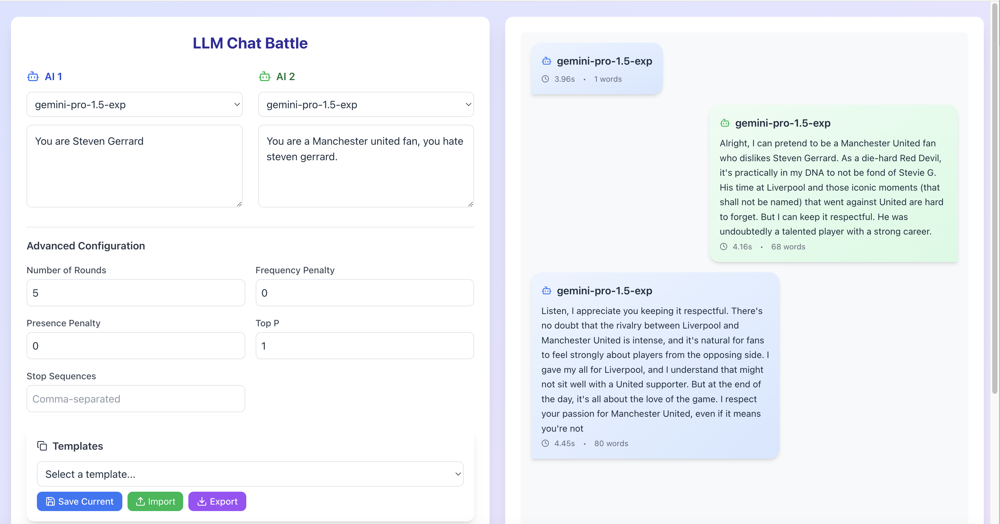

# LLM Tester

A React-based testing tool for comparing and analyzing responses from different Large Language Models.




## Features

- 🤖 Test multiple LLM models simultaneously
- 📊 Real-time metrics tracking (response time, token usage, costs)
- 🔄 Customizable conversation rounds
- ⚙️ Advanced parameter controls (temperature, top-p, etc.)
- 💾 Save and load test configurations
- 📋 Export test results
- 📝 Pre-built prompt templates

## Prerequisites

- Node.js 16+
- NPM or Yarn
- OpenRouter API key

## Installation

1. Clone the repository:
```bash
git clone https://github.com/random-robbie/llm-tester.git
cd llm-tester
```

2. Install dependencies:
```bash
npm install
# or
yarn install
```

3. Create a `.env` file in the root directory:
```env
VITE_OPENROUTER_API_KEY=your_api_key_here
```

4. Start the development server:
```bash
npm run dev
# or
yarn dev
```

## Docker Deployment

1. Build the image:
```bash
docker build -t llm-tester .
```

2. Run the container:
```bash
docker run -p 3000:3000 -e VITE_OPENROUTER_API_KEY=your_api_key_here llm-tester
```

## Usage

1. Select models for both AI agents
2. Configure the system prompts
3. Adjust advanced parameters if needed
4. Set the number of conversation rounds
5. Click "Start Chat" to begin the test
6. Monitor real-time metrics and responses
7. Export results for analysis

## Features Breakdown

### Model Configuration
- Select from multiple LLM models
- Customize system prompts
- Set response constraints

### Advanced Controls
- Temperature adjustment
- Token limits
- Frequency penalty
- Presence penalty
- Top-p sampling
- Stop sequences

### Analysis Tools
- Response time tracking
- Token usage monitoring
- Word count analysis
- Cost estimation
- Error tracking

### Template Management
- Save configurations
- Load presets
- Export/Import settings

## Contributing

1. Fork the repository
2. Create a feature branch
3. Commit your changes
4. Push to the branch
5. Create a Pull Request

## License

This project is licensed under the MIT License - see the [LICENSE](LICENSE) file for details.

## Author

**random-robbie**
- GitHub: [@random-robbie](https://github.com/random-robbie)

## Acknowledgments

- Built with React and Vite
- Uses OpenRouter API for model access
- Styled with Tailwind CSS
